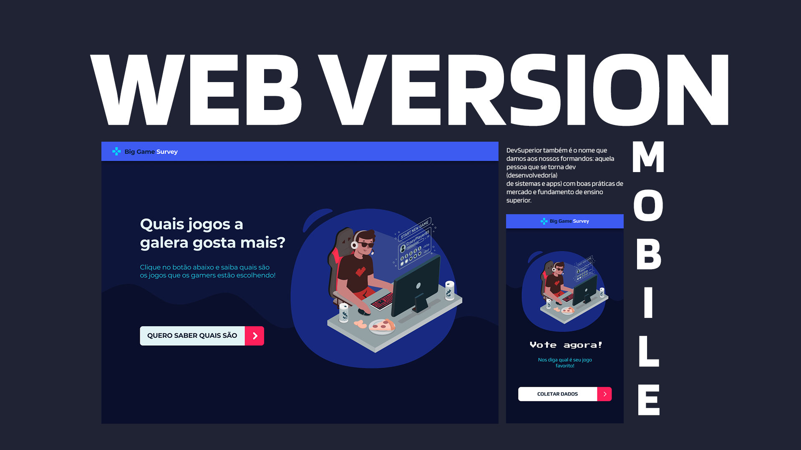

<h1 align="center">Semana Dev Superior</h1>

<h4 align="center"> 🚀🚀 Semana Dev Superior </h4>

DevSuperior é uma iniciativa para ajudar estudantes e profissionais de programação
no início de sua carreira de desenvolvedor. 
A Semana DevSuperior (SDS) foi um evento gratuito que me ajudou a por em prática o que estava estudando sobre programação e a também incluir um projeto daora em meu portfólio. 

#### Projeto em produção 

https://semana-devsuperior-giulia.netlify.app/

